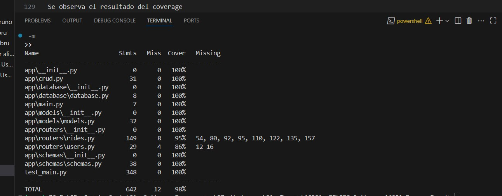

# 05C_Software_16S01_Examen_Final

Se usa de base de datos `SQLite` y de ORM a `SQLAchemy`


## 🚀 Configuración Inicial

### 1️⃣ Clonar el repositorio
```bash
git clone https://github.com/JeanPiero369/05C_Software_16S01_Examen_Final.git
```

### 2️⃣ Configurar entorno virtual
```bash
python -m venv venv
source venv/bin/activate  # En Windows: venv\Scripts\activate
```

### 3️⃣ Instalar dependencias
```bash
pip install -r requirements.txt
```

### 4️⃣ Levantar servidor uvicorn
```bash
uvicorn app.main:app --port 8000 --reload
```

Este es el backend para un sistema de gestión de "rides" en UTEC.

## Endpoints

### Crear un usuario

* **POST** `/usuarios/`
* **Request Body:**
  ```json
  {
    "alias": "jperez",
    "name": "Juan Perez",
    "carPlate": "ABC-123"
  }
  ```

### Listar usuarios

* **GET** `/usuarios/`

### Obtener un usuario

* **GET** `/usuarios/{alias}`

### Crear un ride

* **POST** `/usuarios/{alias}/rides`
* **Request Body:**
  ```json
  {
    "rideDateAndTime": "2025-07-15T22:00:00",
    "finalAddress": "Av Javier Prado 456, San Borja",
    "allowedSpaces": 3
  }
  ```

### Listar rides activos

* **GET** `/rides`

### Listar rides de un usuario

* **GET** `/usuarios/{alias}/rides`

### Obtener un ride

* **GET** `/usuarios/{alias}/rides/{rideid}`

### Solicitar unirse a un ride

* **POST** `/usuarios/{alias}/rides/{rideid}/requestToJoin/{participant_alias}`
* **Request Body:**
  ```json
  {
    "destination": "Av Aramburú 245, Surquillo",
    "occupiedSpaces": 1
  }
  ```

### Aceptar solicitud de unirse a un ride

* **POST** `/usuarios/{alias}/rides/{rideid}/accept/{participant_alias}`

### Rechazar solicitud de unirse a un ride

* **POST** `/usuarios/{alias}/rides/{rideid}/reject/{participant_alias}`

### Iniciar un ride

* **POST** `/usuarios/{alias}/rides/{rideid}/start`

### Terminar un ride

* **POST** `/usuarios/{alias}/rides/{rideid}/end`

### Bajar del ride

* **POST** `/usuarios/{alias}/rides/{rideid}/unloadParticipant`


## 🧪 Pruebas Unitarias

Ejecutar las pruebas de `test_main.py`

```bash
pytest
```

Ejecutar la cobertura

```bash
coverage run -m pytest
```

Generar el reporte
```bash
coverage report -m
```

Se observa el resultado del coverage

<div align="center">
    
</div>
